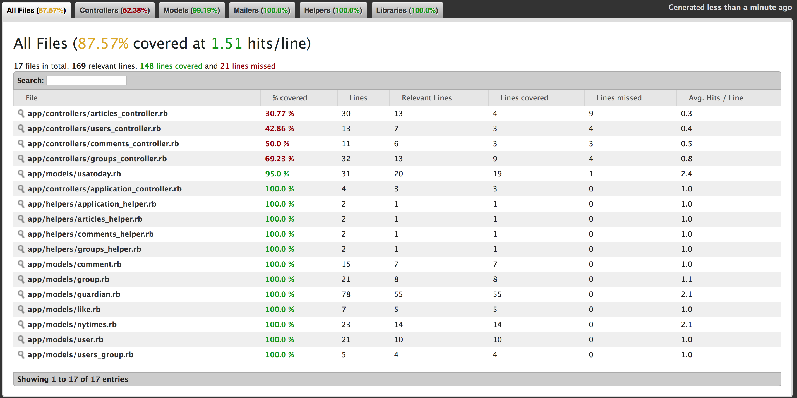

#NewStand
By [Lior ELrom](http://liormb.com/).

##Read the latest news, choose your favorite topic, create and join group descussions

####Resources: The british Guardian, The New York Times and the USA Today newspapers

####With NewStand you can check the latest news of those topics:
* News
* Sports
* Life
* Money
* Tech
* Travel

NewStand combind from 5 models:
* [User](https://github.com/liormb/NewStand/blob/master/app/models/user.rb): authenticate new and existing user
* [Article](https://github.com/liormb/NewStand/blob/master/app/models/article.rb): handeling the API responces
* [Group](https://github.com/liormb/NewStand/blob/master/app/models/group.rb): managing the groups created by the users
* [Comment](https://github.com/liormb/NewStand/blob/master/app/models/comment.rb): allowing users to add there own comments
* [Like](https://github.com/liormb/NewStand/blob/master/app/models/like.rb): share and express your appriciation

##Screenshots

Discovering the daily news

Read the article that you find interesting

Create new group descussion

##Testing

I am using [rspec](http://rspec.info) and [Capybara](https://github.com/jnicklas/capybara) in order to test this application and to give you a better and stable application.
I'll appriciate any help or advice to make those test better in order to give you the most stable application I can give.

Screenshot of the latest testing result provided by [SimpleCov](https://github.com/colszowka/simplecov)

##Explor NewStand at:
NewStand: http://newstand.herokuapp.com/

###Other interesting project:
BlockOverflow: http://blogjunky.herokuapp.com

